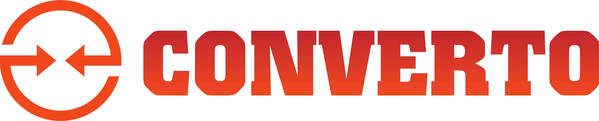

# 🚀 Converto - a project deploy by UIT Students

---

Welcome to Converto, the final project for the Visual Programming (IT008) course.

Converto is a client-server application for much transition beetween a lot of files tool (include Video/Audio, Image, PDF/Document and GIF convert). This project applies core concepts from the course, including visual programming by C#, how to create animation.

## ℹ️ Course Information

* **Course:** Visual Programming (IT008)
* **University:** University of Information Technology - VNU-HCM
* **Instructor:** Ths Võ Tuấn Kiệt

---

## ✨ Key Features

* **[Convert]:** Seamlessly convert between popular file formats with high-performance processing and zero quality loss.
* **[Compress]:** Smart file compression algorithms that significantly reduce file size while maintaining original visual fidelity.
* **[Remove background]:** AI-powered background removal tool that automatically detects subjects and creates transparent backgrounds instantly.
* **[Markdown to text]:** Efficiently parse and convert raw text or HTML content into clean, structured Markdown syntax for documentation.

---

## 🛠 Tech Stack

The project is built using a modern, decoupled architecture:

* **Programming Languages:** C#, Python
* **Frontend:**
    * **WPF (.NET):** For a responsive and native Windows desktop experience.
* **Backend:**
    * **FastAPI:** High-performance web framework for building APIs with Python.
    * **Pydantic:** Data validation and settings management using Python type hints.
* **DevOps & Tools:**
    * **Docker:** Containerization for consistent deployment environments.
    * **GitHub Actions:** Automated CI/CD pipelines.
    * **Pytest:** Robust testing framework for the backend.
    * **Git:** Distributed version control system.

---

## 📸 Screenshots / Demo

**Dashboard:**

**Convert:**

**Compress:**

**Remove background:**

**Markdown to text:**

---

## 👥 Team Members

| No. | Full Name | Student ID | Role |
| :--- | :--- | :--- | :--- |
| 1 | [Phan Huỳnh Hưng] | [24520623] | [Team Leader, Backend, UI/UX] |
| 2 | [Nguyễn Đức Hoàng Thuận] | [24521740] | [Frontend, Documentation] |

---

## 📜 License

This project is licensed under the [MIT License](LICENSE).
